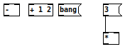
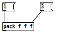
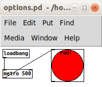
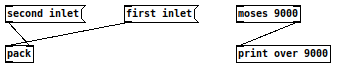
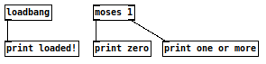
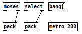
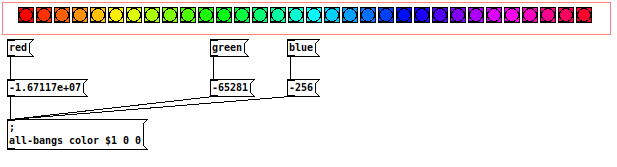
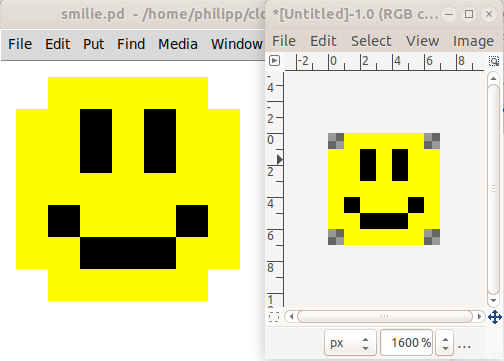

# Tutorial

- [Start PureData](#start-puredata)
- [Create Patches](#create-patches)
- [Nodes](#nodes)
- [Node Arguments](#node-arguments)
- [Options](#options)
- [Inlets and Outlets](#inlets-and-outlets)
- [Referencing Nodes](#referencing-nodes)
- [Connecting Nodes](#connecting-nodes)
- [Colors](#colors)
- [Images](#images)

## Start PureData

PureData can be started by calling `startup`.
(Make sure that the `pd` executable can be found in your `PATH`.)
When started this way, it will automatically load a patch that establishes a connection to clj-puredata.
You can then load patches by calling `load-patches`.
If these patches are later updated / rewritten using `write-patch-reload`, they will automatically be reloaded in PureData as well.

```clojure
(startup)                        ; Start PureData.

(startup "test.pd")              ; When supplied with an argument, clj-puredata tries to load the patch immediately.
                                 ; This will fail when PureData takes longer than 3 seconds to start. Sorry!

(load-patches "test.pd")         ; This is another way to load one or multiple patches.
(load-patches "one.pd" "two.pd") ; etc.
```

## Create Patches

Patches are created using `write-patch` or `write-patch-reload`.
When a patch has previously been opened in PureData using `load-patches`, then evaluating `write-patch-reload` will reload that patch in PureData automatically.
A number of options can be supplied to customize the patch itself - see [the list of options](options.md).

```clojure
(write-patch
  "filename.pd"                                   ; First argument is the patch filename.
  {:width 300 :height 200}                        ; The second argument can (optionally) be an options map.
  
  [:print [:float 0 [:loadbang {:name 'onLoad}]]] ; Any other arguments are treated as nodes.
  [:msg "loading" (other 'onLoad)]
  ...
  )
```

## Nodes

Nodes are created from vectors like `[:+ 1 2]`.
The first element must always be a keyword like `:print` or a string like `"subpatch.pd"`.
Signal nodes always end with a dash `-` (not a tilde `~`), like `[:osc- 440]`.
A list of supported nodes and their names can be found in [`Nodes.md`](nodes.md)

```clojure
(write-patch "basics.pd"
                              ; Nodes are created from hiccup-inspired vectors.
                              ; (see https://github.com/weavejester/hiccup#syntax)
             [:-]             ; The first item is always the node name, as a keyword.

             [:+ 1 2]         ; Literals (numbers, strings) are passed as creation arguments.
             [:msg "bang"]

             [:* [:msg 3]]    ; Nesting nodes creates connections between them.

                              ; Note these special cases:
             ["subpatch.pd"]  ; If the first item is a string, it will render as a subpatch.
             [:*- 1 [:osc-]]) ; Signal nodes have a `-` (dash) (instead of a `~` (tilde)) appended to their name.
                              ; (This is because tilde has special meaning in Clojure.)
```



## Node Arguments

Inside a node vector, everything that isn't the first item, or an options map as the second item, is treated as an argument.
If the argument is a literal number or string, those are used verbatim.
If the argument is another node, a connection is formed.
For nodes, the position of arguments determines the target inlet (unless otherwise specified using `inlet`).

```clojure
(write-patch "arguments.pd"
             [:pack \f \f ; Argument position determines the connection inlet:
              [:msg 1]    ; Connected to first inlet.
              nil         ; `nil` skips an inlet.
              \f          ; Literals don't influence inlet count and are concatenated regardless of position.
              [:msg 3]])  ; Connected to third inlet.
```



## Options

Options can be passed as the second argument to both Nodes (through hiccup) and Patches (through `write-patch` etc.).
You can find a list of supported options in the [List of supported Options](options.md).
These are relevant for UI nodes like Sliders, Toggles, Bangs etc., and also contain the graphing options for subpatches.

```clojure
(write-patch "options.pd"
             {:width 200 :height 80} ; Set patch options as the second argument to `write-patch`.
             [:bng {:name 'b         ; Set node options as the second element in hiccup vectors.
                    :x 100 :y 5
                    :size 64
                    :label-text "red!"
                    :fg-color -258049}
              [:metro 500 [:loadbang]]])
```



## Inlets and Outlets

To specify which inlet or outlet two nodes connect on, use the `inlet` and `outlet` functions.

```clojure
(write-patch "inlet-and-outlet.pd"
             [:pack
              (inlet [:msg "second inlet"] 1)              ; Specify target inlet explicitly with `inlet` function.
              (inlet [:msg "first inlet"] 0)]
             [:print "over 9000" (outlet [:moses 9000] 1)] ; Specify target outlet explicitly with `outlet` function.
             [:+ 1 (inlet (outlet [:select 3] 1) 1)])      ; `inlet` and `outlet` can be combined.
```



## Referencing Nodes

TODO: show how `let` and `pd` can be used to reference nodes.


```clojure
(write-patch "other.pd"
             [:loadbang {:name 'lb}]                      ; Giving Nodes a `:name` allows them to be referenced by `other`.
             [:print "loaded!" (other 'lb)]
             [:print "zero" (other 'm)]                   ; The named Node can be defined later, too.
             [:print "one or more" (outlet (other 'm) 1)] ; `inlet` and `outlet` also work with `other`.
             [:moses {:name 'm} 1])

```



## Connecting Nodes

```clojure
(write-patch "connect.pd"
             (connect [:loadbang] [:print "hello world!"]) ; Use `connect` to connect nodes explicitly.
             (connect [:moses] 1 [:pack] 1)                ; Use 4 arguments to specify inlet and outlet ...
             (connect (-> [:select]                        ; ... or use `inlet` and `outlet` explicitly.
                          (inlet 1)                        ; Note: they are used on the originating node.
                          (outlet 1))
                      [:pack]) 

             [:msg {:name 'tik} "bang"]
             [:metro {:name 'tok} 200]
             (connect (other 'tik) (other 'tok)))          ; It works fine with `other` as well.
```



## Colors

```clojure
(let [hues 32
      size 18
      width (+ 32 (* hues size))]
  (write-patch
   "colors.pd"
   {:width width
    :view-width width
    :view-height 32 :graph-on-parent 1}
   [:msg "; all-bangs color $1 0 0"
    (inlet [:msg (color-runtime 255 0 0) [:msg "red"]] 0)       ; Use `color-runtime` for sending color values during runtime.
    (inlet [:msg (color-runtime 0 255 0) [:msg "green"]] 0)
    (inlet [:msg (color-runtime 0 0 255) [:msg "blue"]] 0)]
   (map #(vector :bng {:x (+ 16 (* % size)) :y 5
                       :receive-symbol "all-bangs"
                       :bg-color (color-file                    ; Use `color-file` for color values stored in the file.
                                  (hsl2rgb (/ % hues) 1 0.5))}) ; Helper function `hsl2rgb` is available.
        (range hues))))
```



## Images

```clojure
(write-patch "smilie.pd"
  (import-image "smilie.png" 32)) ; Turns a PNG image into colored canvasses.
```


