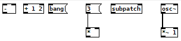

# Tutorial

Basic Usage - Hiccup, Writing

## Basics

### Nodes

```clojure
(write-patch "basics.pd"
             [:-]           ; Nodes are created from hiccup, which is just plain vectors.
                            ; The first item is always the node name, as a keyword.
             [:+ 1 2]       ; Literals are passed as creation arguments.
             [:msg "bang"]  ;
             [:* [:msg 3]]) ; Nesting nodes creates connections between them.
```



### Node Arguments

```clojure
(write-patch "arguments.pd" 
             [:pack "f f f" ; Argument position determines the connection inlet:
              [:msg 1]      ; Connected to first inlet.
              nil           ; `nil` skips an inlet.
              [:msg 3]])    ; Connected to third inlet.
```


### Node Options

You can find supported node options in the [List of supported Options](options.md#node-options).

```clojure
(write-patch "node-options.pd"
             [:tgl {:init 1 :init-value 0 :nonzero-value 100}]) ; options are passed as maps, and *must* be the secondelement in the hiccup vector.
```

### Inlet and Outlet

```clojure
(write-patch "inlet-and-outlet.pd"
             [:pack
              (inlet [:msg "second inlet"] 1)              ; Specify target inlet explicitly with `inlet` function.
              (inlet [:msg "first inlet"] 0)]
             [:print "over 9000" (outlet [:moses 9000] 1)] ; Specify target outlet explicitly with `outlet` function.
             [:+ 1 (inlet (outlet [:select 3] 1) 1)])      ; `inlet` and `outlet` can be combined.
```


### Other

```clojure
(write-patch "other.pd"
             [:loadbang {:name 'lb}]                      ; Giving Nodes a `:name` allows them to be referenced by `other`.
             [:print "loaded!" (other 'lb)]
             [:print "zero" (other 'm)]                   ; The named Node can be defined later, too.
             [:print "one or more" (outlet (other 'm) 1)] ; `inlet` and `outlet` also work with `other`.
             [:moses {:name 'm} 1])
```


### Connect

```clojure
(write-patch "connect.pd"
             (connect [:loadbang] [:print "hello world!"])    ; Use `connect` to connect nodes explicitly.
             (connect [:moses] 1 [:pack] 1)                   ; Use 4 arguments to specify inlet and outlet ...
             (connect (outlet (inlet [:select] 1) 1) [:pack]) ; ... or use `inlet` and `outlet`.
                                                              ; Note: they are used on the originating node.
             [:msg {:name 'tik} "bang"]
             [:metro {:name 'tok} 200]
             (connect (other 'tik) (other 'tok)))             ; It works fine with `other` as well.
```


Patch Options list
Supported Nodes
Node Options list
Live Reloading
Advanced Usage
Recursion


